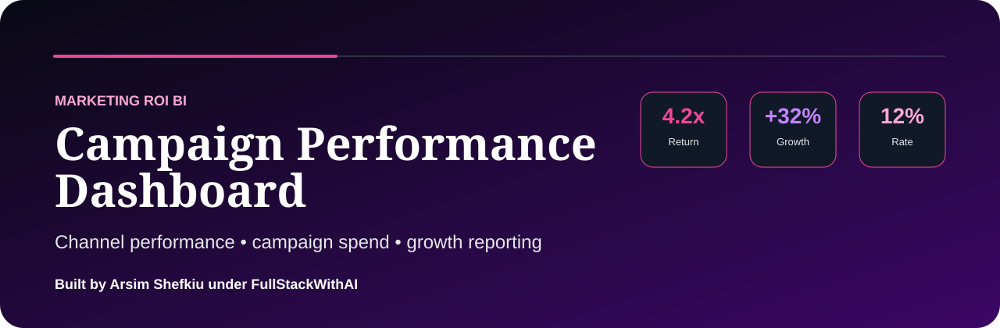

<div align="center">

# MARKETING CAMPAIGN ROI DASHBOARD

### Growth Analytics, ROAS & Campaign Performance Intelligence

**Ad spend. Conversion quality. Channel performance. Growth decisions.**

[](https://www.designhubmk.com)


**Ad spend to performance clarity. Campaign data to growth decisions.**

</div>

---



## Marketing ROI Theme

This repository is presented as a premium marketing analytics dashboard for tracking campaign ROI, paid channel efficiency, lead quality, conversion performance, and budget allocation.

| Theme Layer | Direction |
|---|---|
| **Design Identity** | Purple, pink, black, and performance-marketing accents |
| **Product Feel** | Marketing command center / campaign ROI dashboard |
| **Audience** | Marketing teams, founders, growth analysts, BI hiring managers |
| **Core Message** | Spend + conversions + ROAS + channel performance + growth insight |

---

## Campaign KPI Layer

| KPI | Purpose |
|---|---|
| **ROAS** | Measures return on advertising spend |
| **Cost per Lead** | Tracks acquisition efficiency |
| **Conversion Rate** | Measures campaign quality |
| **Top Channel** | Identifies strongest acquisition source |
| **Budget Waste** | Flags spend that is not producing results |

---

## Business Questions

| Question | Why It Matters |
|---|---|
| **Which campaign generates the best ROI?** | Helps reallocate budget to stronger performers |
| **Which channels waste spend?** | Reduces inefficient marketing costs |
| **Where are conversions highest?** | Identifies strongest audience and message fit |
| **Which leads are most valuable?** | Connects marketing activity to revenue quality |

---

## What This Project Demonstrates

| Capability | Evidence in This Repo |
|---|---|
| **Marketing Analytics** | ROAS, CPL, conversion, and channel-performance thinking |
| **Growth BI** | Dashboard structure aligned with campaign decision-making |
| **Executive Reporting** | Budget and performance signals presented clearly |
| **Data Storytelling** | Converts campaign data into marketing recommendations |
| **Portfolio Positioning** | Strong DA/BI project for growth, marketing, and analytics roles |

---

## Suggested Project Architecture

```text
marketing-campaign-roi-dashboard/
├── assets/
│   └── readme-hero.svg
├── data/
│   └── campaign-performance-sample.csv
├── sql/
│   └── marketing-roi-analysis.sql
├── dashboard/
│   ├── index.html
│   ├── styles.css
│   └── app.js
├── insights/
│   └── campaign-summary.md
└── README.md
```

---

## Author

**Arsim Shefkiu**  
**AI Software Engineer · Full-Stack Developer · SaaS & Automation**

Founder of **DesignHubMK**, building AI-powered software, automation systems, and full-stack digital products.

[](https://www.designhubmk.com)
[](https://www.instagram.com/designhub_mk/)
[](https://github.com/fullstackwithai)

**Website:** https://www.designhubmk.com  
**Instagram:** @designhub_mk

---

<div align="center">

## Marketing Campaign ROI Dashboard

**Ad spend to performance clarity. Campaign data to growth decisions.**

Built by **Arsim Shefkiu · DesignHubMK**

</div>
